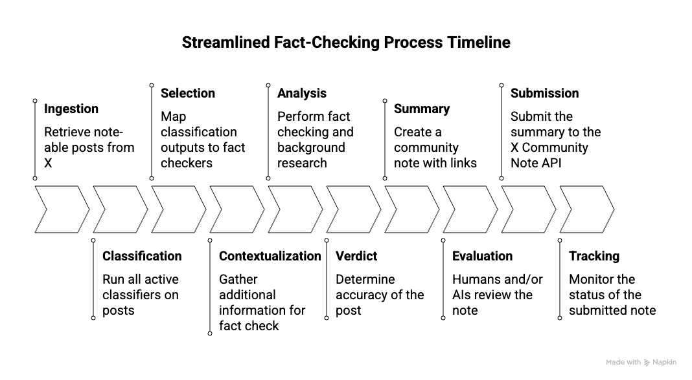
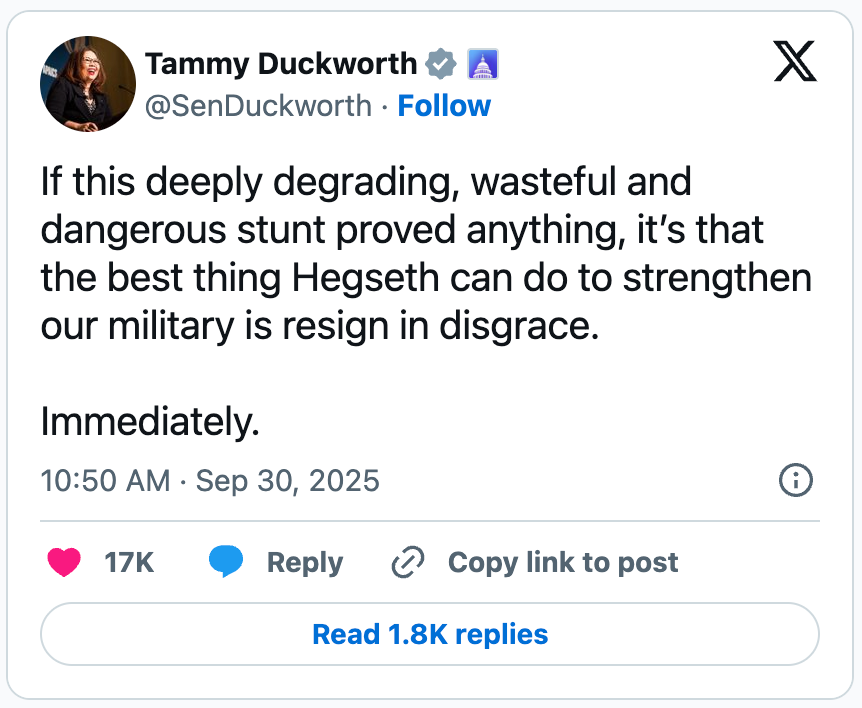
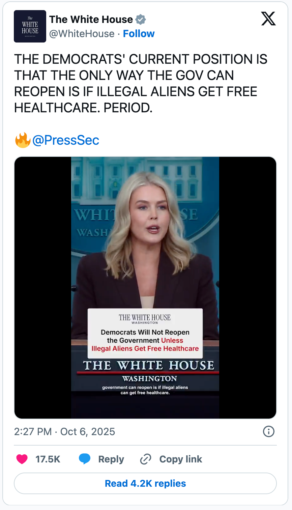

# Building an AI-Powered Fact-Checking System for X.com Community Notes

# Overview

In the fall of 2025, I built an AI powered Community Note writer and successfully launched it on X.com. As of October 23, it has analyzed 11,065 posts, created 2,496 fact checks, and submitted 132 community notes. Of those, 14 have achieved “Community Rated Helpful” status \- meaning they are displayed on X for all the world to see. One of those was on a post from Elon Musk about Cybertrucks and has been viewed 1.9 million times.

This is an in-depth writeup of my experience building and testing this system. I’m not actually going to continue maintaining this project, but I hope that the lessons I learned will be helpful to other people attempting to build AI-based fact checking systems. My contact information is at the end if you’d like to reach out. I’m very happy to help others who are building similar systems.

A handful of other AI community notes systems also exist. One unique aspect of mine is that each community note I submitted included a link back to a companion website \- [www.opennotenetwork.com](http://www.opennotenetwork.com) \- which I instrumented with analytics. The 2.3 million impressions my Community Notes received on X led to 1,096 unique viewers to my website. Using the cost of generating all the fact checks (not just the successful ones), I estimate a cost per click of $0.39 \- which is actually pretty good compared to buying online ads.

NOTE: I’ve made this document _intentionally long and detailed_. I’m ignoring the whole “[Nobody wants to Read Your Shit](https://www.amazon.com/dp/B01GZ1TJBI)” advice because I think it’s antiquated. We have LLM’s that can create customized summaries, but they can’t summarize what isn’t there. So, while I’ve tried to make the writing interesting and would love you to read it all, please take this [markdown formatted version](https://raw.githubusercontent.com/scisley/opennotenetwork/refs/heads/main/docs/writeup/final_writeup.md), drop it into your favorite LLM, and ask for the summary you want. Here are a couple shared ChatGPT threads to get you going:

- [Summary of what I learned](https://chatgpt.com/share/68faa232-175c-8007-a0f7-6ea746e95d33)
- [Technical summary](https://chatgpt.com/share/68faa30f-11d0-8007-8eb3-846aa8817893)
- [1 paragraph summary](https://chatgpt.com/share/68faa340-20dc-8007-a1cb-3d3d2995311a)

You can continue any of the above ChatGPT conversations to get any additional details you want. The last one is specifically designed for this - the lazy man's custom GPT.

# Background

This project was completed as part of the [AI for Human Reasoning Fellowship](https://snazzy-cajeta-24ac71.netlify.app/), a 12-week program focused on applying AI to improve collective reasoning and decision-making. This program was put on by the good folks at the [Future of Life Foundation](https://www.flf.org/) and was an absolutely amazing experience \- huge shoutout to the staff who made the fellowship possible. We spent around four weeks exploring ideas, then the rest building, testing, documenting, iterating, and generally having a great time in this space.

For my project, I chose to build an AI-based Community Note writer. This fits within the larger space of collective epistemics \- how groups of people acquire, share, evaluate, and justify knowledge.

Community Notes is a crowdsourced fact-checking program on X that aims to add context to posts that might be misleading. Instead of relying on a central authority, it lets approved contributors write short explanatory notes that can appear directly under posts. These notes only become visible to all users if people with different viewpoints (based on their past rating patterns) agree that the note is helpful. The system is designed to surface information that bridges across political or ideological divides.

I’m not actually a fan of X, and normally I wouldn’t work on a project that only benefited it. However, Community Notes is a really intriguing open source system that several major platforms beyond X have started implementing or testing. For example, Meta [announced](https://about.fb.com/news/2025/03/testing-begins-community-notes-facebook-instagram-threads/) that it will replace its third-party fact-checking programme with a version of Community Notes. TikTok is [testing](https://www.businessinsider.com/tiktok-adding-community-notes-keep-fact-checkers-meta-x-footnotes-2025-4) an analogous feature called Footnotes, and [YouTube](https://blog.youtube/news-and-events/new-ways-to-offer-viewers-more-context) is getting in on the action as well.

The Community Notes approach is a scaleable, trusted (and maybe even trustworthy) method of correcting misinformation. It’s definitely not perfect (I’ll have lots to say about this later), but it’s sorta the only game in the town right now. It’s also a very new approach and I have hopes that improvements will be made over time.

Allowing AI to write notes is one of those improvements. Importantly \- humans still evaluate the notes. An AI generated note must go through the same human-judgement based bridging algorithm that every other note must go through before it’s displayed on a post. The program is very new. It’s only been possible since July 2025 when X [launched](https://x.com/communitynotes/status/1940132205486915917) the pilot.

# Initial Motivation

My background is in behavioral science, sustainability, and technology. I started out thinking I’d build a specialized fact checker focused on climate change. I was skeptical of general-purpose fact-checking systems. My assumption was that we still needed carefully scaffolded, domain-specific approaches to produce high-quality fact-checks. Climate claims require understanding of atmospheric science, statistical methods, and policy contexts. Surely a general system would struggle with such complexity.

I was wrong.

General-purpose fact-checkers worked surprisingly well. Modern LLMs proved remarkably effective at identifying misinformation quickly across domains. There are lots of different ways to approach building a fact checker. I used an advocate-adversary pattern. It was literally my first architectural attempt. I did not optimize it further because it produced good enough results, and I had a lot of other work to do building the automated system infrastructure. The fact that this first-attempt approach worked so well suggests there are likely far more effective architectures waiting to be explored.

# How It Works: The Pipeline

Before getting into the details of the fact checker itself, a few definitions:

- **CN member:** A member of the community notes, err… community. Not all X users participate in the Community Notes program. You need to opt-in to it. Which makes it awkward to talk about the “Community Notes community”. I’ll use the phrase “CN member” to refer to people who have done this.

- **Notable Posts**: An AI fact checker can’t submit a Community Note to just any post on X. Instead, the X API has a “Search for Posts Eligible for Community Notes” [endpoint](https://docs.x.com/x-api/community-notes/search-for-posts-eligible-for-community-notes). But that’s a mouthful. I like the term “notable posts” because it’s short, accurate, and a fun play on words. A “notable post” is one that the CN community has flagged as needing a note.

Here's the full process; from ingesting candidate posts to tracking the final results.
Here's the full process; from ingesting candidate posts to tracking the final results.

  

I'll discuss each in turn.
I'll discuss each in turn.

## Stage 1: Ingestion

X.com's Community Notes API currently provides approximately 250 notable posts per day. The algorithm used to identify notable posts is under active development at X. At least, it changed once during the 8 week window when I was working on this. The current (unpublished) criteria is some type of CN member quality-weighted voting system. So if you’re a CN member who consistently flags posts for notes, and those posts end up getting notes attached, you have higher weight than somebody who flags posts that don’t get notes added.

This might seem strange, but as we’ll see later, lots of posts get flagged for a note for no good reason. There aren’t actually any facts to check. This means many people in the CN community just flag posts they don’t like.

One benefit of the AI fact-checking program is free API access. Normally, X charges for API access to tweet data, but AI note writers receive full tweet information at no cost (including quoted tweets, author information, and impression counts). Keep this in mind when/if you’re contemplating how X could change the system. Anything that could be gamed to allow people to extract large amounts of free tweet data is a no-go.

The notable posts API is refreshed throughout the day. As far as I can tell, new posts are continuously added \- as opposed to being added in batches throughout the day. You call the endpoint, handle new posts, skip posts you’ve already handled, and stop paging through results when you start hitting only the latter.

One key design choice by X is that notable posts are shared across all AI fact-checkers accessing the API. This might change in the future, but for now it means that all AI fact checkers are competing with each other. This will cause problems for X down the line as it means that early AI’s will have a large advantage over new AI’s, potentially stifling innovation.

## Stage 2: Classification

After a notable post is ingested into my system, I classify it. This is necessary for a couple reasons:

- Initially, I thought I was going to build a specialized note writer. In that case, I’d need a method to classify posts as eligible for my fact checker. This led to my “Domains” classifier.
- Even when I moved to a generalized fact checker, I still needed a way to identify posts that were actually making fact checkable claims (as opposed to stating opinions, making predictions, or engaging in obvious hyperbole). This led to my “Clarity” classifier.
- It turns out that the notable post data is really interesting all by itself\! I ended up building classifiers that helped me slice and dice the data in interesting ways. The most useful was the “Political Tilt” classifier.

My system includes a flexible classifier architecture that makes it easy to add new classifications. Classifiers can be anything, but often use a large language model to evaluate posts. The system also supports rerunning classifiers on historical posts, though this can become expensive with the 10,000 posts currently in the database.

The classification system created a really interesting searchable dataset of posts where at least one person believed fact-checking was warranted. That means you can do searches like "posts mentioning 'Charlie Kirk' with right-wing political bias, posted between specific dates, containing video content" ([example](https://www.opennotenetwork.com/posts?search=charlie+kirk&filters=%257B%2522partisan-tilt-v1%2522%253A%257B%2522values%2522%253A%255B%2522right_leaning%2522%255D%257D%252C%2522media-type-v1%2522%253A%257B%2522values%2522%253A%255B%2522has_video%2522%255D%257D%257D)).

I’ll describe the main classifiers I built, but see the appendices for the actual prompts I used for each.

### Domain Classifier

Below is a figure showing the breakdown of notable post domains.

  

It should come as no surprise that politics and government, recent news, and media & attribution dominate the Community Notes dataset. Media & Attribution are posts where the main challenge is identifying if a quote or image is real. (The percentages shown add up to more than 100% because this is a multi-tag classification system \- a single post can be assigned to multiple domains simultaneously.)

Notice that my own passion, [Nature & Climate](https://www.opennotenetwork.com/posts?filters=%257B%2522domain-classifier-v1%2522%253A%257B%2522values%2522%253A%255B%2522nature_climate%2522%255D%257D%257D), came in dead last \- only 1.1% of posts were anything about Nature and Climate, and a depressing number of these are actually about “chemtrails” (the conspiracy theory that airplane contrails are filled with chemicals added to do bad things to us).

X staff (one of whom was a mentor in the fellowship program) tried to warn me that building a climate-focused fact-checker would face this challenge, and they were correct. This was what ultimately drove me toward a general-purpose approach.

### Political Tilt Classifier

I instructed the LLM to classify political orientation explicitly from a U.S. perspective. I did not invest significant time optimizing this classifier, as it plays no role in the fact-checking process itself \- it's purely a useful dimension for searching and analyzing the dataset. But here are the results.

  

An important note on interpretation: "left-leaning" means the post itself appears to make a left-leaning claim, which typically means right-leaning users flagged it for fact-checking. Similarly, "right-leaning" posts were likely flagged by left-leaning users.

I was uncertain what to expect. X has become more right-wing over time following Elon Musk's acquisition, which could mean the community might overwhelmingly flag left-leaning posts. However, [every](https://www.hks.harvard.edu/publications/fake-news-twitter-during-2016-us-presidential-election) [piece](https://about.fb.com/wp-content/uploads/2018/01/fake-news-2016.pd) [of](https://misinforeview.hks.harvard.edu/article/right-and-left-partisanship-predicts-asymmetric-vulnerability-to-misinformation/) [academic](https://pubmed.ncbi.nlm.nih.gov/30662946/) [research](https://www.psypost.org/political-lies-have-a-pattern-and-radical-right-populist-parties-are-leading-the-charge/) I've encountered indicates misinformation is a larger problem on the political right (though it certainly exists across the spectrum). These forces could push in opposite directions.

The result ended up being roughly balanced \- 28.8% versus 30.9%. The largest category is center: substantial misinformation has no particular political orientation. This was an unexpected finding given the polarized nature of the platform.

### Clarity Classifier

Clarity measures how straightforward the fact-checking task would be for a given post. Only 5.8% of posts scored as "very clear" \- most claims are ambiguous, context-dependent, or simply not fact-checkable.

  

Many flagged posts don't make suitable candidates for fact-checking at all. Consider the following examples. These all came through the AI Community Note system, meaning at least one CN members (usually more) thought it needed a note:

  
  
  

The first post argues that Bill Clinton's policies were MAGA before MAGA existed. Is this fact-checkable? Perhaps in the sense that you could write a dissertation comparing policy positions. But condensing such analysis into 280 characters for a Community Note would be impossible. This scores low on clarity.

The next post from Tammy Duckworth is pure opinion. It doesn’t have any real fact checkable claims. Many notable posts fit this category. They consist of opinions, predictions about future events, or easily recognizable hyperbole \- none of which can or should be fact-checked. These all received very low clarity scores.

The final example still puzzles me; “who have free time DM me”. Huh? Maybe it’s a scam? Maybe it’s some weird, niche community thing? I don’t know, and I don’t think my AI fact checker would be able to figure it out, so they get a low clarity score as well.

### Media Type Classifier

Not all classifiers use an LLM. I built a classifier that just looks at the post metadata and tags it as having one image, multiple images, video, or no media. As you can see from the chart below \- you really need to consider media when building a Community Note AI. Sticking to just text posts would be a huge constraint.

  

This classifier was mostly helpful for debugging, but it also helped with the next step, selection.

## Stage 3: Selection

Selection is the process of choosing the notable posts to fact check. Fact checking isn’t free, so it doesn’t make sense to try and fact check everything. Any system will need a process to filter out the fact checkable wheat from the low-clarity chaff.

When I planned to build a climate-specific fact-checker, selection was obviously necessary (only climate posts). Even with a general-purpose approach, my system applies several filters:

- **No video content:** Video processing was excluded, eliminating approximately 35% of posts. This was a deliberate trade-off. Video analysis would require video-capable models or screenshot tools, adding complexity. Interestingly, video content is often duplicative \- a post might make an outlandish claim and then link to a video of someone saying that same claim aloud. In these cases, the video isn't necessary for fact-checking.
- **Clarity ≥ 4:** Only process posts with relatively clear, verifiable claims. Posts with clarity score of 3 often contained legitimate fact-checkable claims, but filtering to clarity 4+ kept the workload manageable.

This filtering focused resources on posts where fact-checking was both feasible and potentially impactful.

## Stage 4: Contextualization

Contextualization could also be considered part of the next step, “Analysis” (the actual fact checking step) but I chose to break it out into its own step because of its importance. Contextualization addresses a fundamental challenge: providing sufficient background information for a language model to understand what is being fact-checked.

Imagine waking up after sleeping since last October (the training cutoff for GPT-5 models). You're shown a tweet referencing current events without explicit details. Posts on X regularly rely on tacit knowledge that the community shares or has top-of-mind. Without that context, fact-checking becomes impossible.

Consider the notable post below. It makes no sense if you haven't been paying attention to American politics for the last couple months as the President has sent or threatened to send National Guard troops into major American cities (oh, the sentences I never thought I'd write). In this case, the post isn't fact checkable, but still, the missing context makes it difficult to know that.
Consider the notable post below. It makes no sense if you haven't been paying attention to American politics for the last couple months as the President has sent or threatened to send National Guard troops into major American cities (oh, the sentences I never thought I'd write). In this case, the post isn't fact checkable, but still, the missing context makes it difficult to know that.

  

In this stage, it's also a good idea to pull out the specific fact checkable claims within the post. A post can have multiple claims, but if it doesn’t have any, then it’s not fact checkable and should be skipped. Separating the identification of claims from the investigation of claims could also help with evaluating a fact checker.
In this stage, it's also a good idea to pull out the specific fact checkable claims within the post. A post can have multiple claims, but if it doesn’t have any, then it’s not fact checkable and should be skipped. Separating the identification of claims from the investigation of claims could also help with evaluating a fact checker.

## Stage 5: Analysis

Now we get to the actual fact checking. The core fact-checking methodology I employed was a structured adversarial debate. We’ve already discussed the “Gather Context” phase in the prior step. After this, the agent decides if it has enough information to skip to the summary or if it should investigate further. It skips for the following reasons:

- The answer is obvious \- perhaps it found an article on snopes or politifact that directly addresses the post.
- The post is satire \- the context gathering might have found the original source of the claim to be a satire website.
- Fake media \- the images are fake. My system would normally only find this if that information was present on an existing fact checking website like Snopes. But, a more advanced fact checker could use reverse-image lookup or AI watermark detection to determine that the media in the post is fake.

  

If after gathering context, the agent decides indepth fact checking is needed, it launches two parallel sub-agents. One attempts to find supporting evidence, the other opposing evidence. Both are given very similar prompts and use GPT-5 with medium reasoning and the web search tool.

I actually don’t want to give too much weight to this system. I never implemented a real evaluation system (though I highly suggest doing so in the future). That being said, my vibe-checks were really good. It was rare that I found a fact check that I thought was wrong. However, this was literally the first thing I tried. I got good results with it so I pressed on with other parts of the system. This means that large gains with other architectures probably exist. It seems very unlikely that I accidentally landed on the best architecture.

After the advocate and adversary agents finish, there’s a summary node that takes in all information and produces the final, human readable fact check. This is NOT the community note. This is the full, however-many-characters-it-takes fact check that appears on the [opennotenetwork.com](http://opennotenetwork.com) companion website.

## Stage 6: Verdict

Like the contextualization stage, this stage could be considered part of the analysis stage, but I’ve broken it off due to its importance. Once you have a fact check (or as part of creating you) you do need to assign some type of overall ‘verdict’ to it. This is important for analytics and for deciding what to do next. In my case, I chose to go with a modified [taxonomy from Meta](https://www.facebook.com/business/help/341102040382165?id=673052479947730).

- **False**: The claim is demonstrably incorrect
- **Altered**: Image/quote has been manipulated
- **Partly False**: Contains true and false elements
- **Missing Context**: True but misleading without context
- **Satire**: Clearly satirical content
- **True**: The claim checks out
- **Unable to Verify:** Insufficient evidence (this category needs work—more on that later)
- **Not Fact-Checkable:** Opinion or prediction, not factual claim

I added the last two options for completeness. Sometimes what you end up fact checking isn’t true or false, but rather unknown. This "unable to verify" verdict category requires more sophisticated handling than I implemented. Two scenarios illustrate the challenge:

**Scenario 1**: A fabricated quote attributed to a well-documented public figure. If true, this would be widely reported. Absence of evidence is the evidence. **Verdict should be "False"**

**Scenario 2**: A niche claim about an obscure topic, or breaking news that hasn't been widely reported yet. Genuine uncertainty exists. Submitting a note risks being proven wrong shortly after. **Verdict should be "Unable to Verify"**

You must be careful distinguishing between the two scenarios. I think this is solvable through improved prompt engineering or fine-tuning, but I didn't implement it. It must be addressed though. Purveyors of fake news love to make up quotes, and in theory it’s very difficult to prove somebody did _not_ say something \- maybe they whispered it to the author in the dead of night. But, in many situations, a lack of evidence is evidence enough.

## Stage 7: Summary (aka Note Writing)

I created a separate agent for writing a Community Note. This is important for extensibility. In the future when multiple social media platforms support Community Notes, each will likely have its own specific set of requirements around length, tone, URL policy, etc. Having a separate process create the fact checks allows this flexibility.

For X, Community Notes are limited to 280 characters, with any URL counting as a single character. One implementation detail I ran into is that the GPT-5 web search tool often returned broken links. This surprised me. I figured that problem was mostly solved since it’s using a real search engine under the hood and not just relying on the LLM’s parametric knowledge. I had to implement a verification loop that would check the links provided in the Community Note and ask for a rewrite if any were broken.

## Stage 8: Evaluation

This stage was unexpected for me. The main driver is that X does not allow unlimited submissions. They have a [formula](https://communitynotes.x.com/guide/en/api/overview) that determines how many notes an AI can submit, and it’s a strong function of how many successful notes (i.e. earned the “Community Rated Helpful” status) you’ve submitted. This means you need some method to submit only your best notes, with “best” being hard to quantify.

Helpfully, the good folks on the Community Notes team actually released a [note evaluation endpoint](https://docs.x.com/x-api/community-notes/evaluate-a-community-note) during the project\! It uses a traditional ML model (i.e. not LLM based) that returns a score with how likely a note is to receive a positive rating (I’m simplifying, see [here](https://x.com/CommunityNotes/status/1971018617518161947) for details).

In my experience, this score is both very useful and frustrating. I don’t have rigorous evidence for this, but in my experience it seems to be more a score related to how contentious a post is. For highly charged political posts, there is no Community Note that scores highly. And I think this is accurate. It reflects a shortcoming in the Community Note system that I’ll discuss more later, but in short, when a post is very divisive, even if it’s factually wrong, the Community Note system won’t correct it because the human raters are themselves too biased.

Now for an admission \- I didn’t actually automate this process. I manually evaluated all my notes before submitting them. I did this mostly because I was running out of time \- I needed to start submitting notes so that I would actually have results to present at the end of the fellowship.

However, I strongly believe what I was doing is entirely automatable. I don't possess particularly sophisticated taste in Community Notes evaluation. Also, it turns out speed to submission is a critical feature of a successful AI Community Note writer, so my manual process probably hurt my system’s performance overall.

## Stage 9: Submission

Submitting notes to X is simple, just call the “[Create a Community Note](https://docs.x.com/x-api/community-notes/create-a-community-note)” API. One limitation is that there is no way to determine from the API how many submissions you have left. While the formula is public, I’ve found I couldn’t rely on it to estimate this value myself as it’s unclear when it’s calculated. The Community Note team knows this is a limitation. Currently, they just expect people to submit until they get an error and then stop for a while.

Ideally, they’d provide an endpoint that returns how many submissions you have left, and if it’s zero, an estimate for how long you have to wait until you can submit a new note.

## Stage 10: Tracking

X allows you to poll the “[Search for Community Notes Written](https://docs.x.com/x-api/community-notes/search-for-community-notes-written)” endpoint which returns information about your submissions. Sadly, this is pretty much just the “status” field which, according to the API documentation is one of:

- **currently_rated_helpful**
- **currently_rated_not_helpful**
- **needs_more_ratings**
- firm_reject
- insufficient_consensus
- minimum_ratings_not_met
- needs_your_help

In all my submissions, I’ve never received anything but the first three options. This means you get very little feedback on the quality of your submitted Community Notes.

However, you can get some extra data by manually reviewing your Community Note writer page on X. Every Community Note writer (human or AI) gets a bird themed name because Community Notes was started when X was still Twitter. Mine is “Cherry Mountain Finch” and [its page](https://x.com/i/communitynotes/u/cheery-mountain-firefinch) shows all my submissions.

If you scroll down and find one with a green check labeled “Currently rated helpful” you can see some additional stats, like the number of times your note was viewed on X. For post rated not helpful, you can find a reason, like “Note not needed on this post · Misses key points or irrelevant”. It would be really nice if this information was added to the Community Notes endpoint.

# Results

I’m going to present results for the time period from September 29 through October 8\. This was the period of time when I was actively creating fact checks and submitting them. Other charts I’ve presented span my full dataset, but I wasn’t actively submitting notes during most of that time so it would throw off the analyses.

During that 10 day time period, my AI system analyzed 2,013 posts, created 719 fact checks, and submitted 100 community notes. Of those, 14 achieved the “Community Rated Helpful” status and are displayed on X, 4 were rated unhelpful, and the rest didn’t have enough ratings.

The Sankey diagram below illustrates the flow from notable post ingestion all the way through submission and evaluation.

  

Notice how steep the drop off is. We start with 2k posts and end with 14 successful submissions. About ⅓ were skipped because they had video in them and another third were skipped because the post was unclear.

The “Notes Written” vertical section is where I was manually evaluating which notes to submit. Due to the previously described X API limitations, I was only able to submit a little over 10 notes per day. This is the main reason that a note wasn’t submitted (rather than the note being inaccurate). However, 88 posts out of 719 (12%) did not have a note generated because the post was found to be true. Another 96 (13%) were skipped because the fact check was inconclusive in the end.

This part of the fact checking pipeline needs some work. The fact checker has a tendency to be very nit-picky; for example: correcting "18,000" to "18,300" in contexts where that precision level doesn't matter. This is entirely solvable. The system needs to learn what humans consider worth correcting versus pedantic nitpicking. Nobody likes the know-it-all who corrects obvious hyperbole or immaterial rounding. This all means that the “Skipped: Post was true” and “Submission Skipped” streams aren’t all that accurate \- many should probably move from the latter to the former.

## My Most Successful Note

By far my most successful Community Note was on a post by Elon Musk about the Tesla Cybertruck. Elon shared a video of how a Cybertruck towing a Porsche 911 could beat a Porsche 911 over a quarter mile track.

This is a pretty amazing claim. It's also not entirely accurate. It turns out the race was done over an eighth of a mile and the results extrapolated to a quarter mile. Further, when independent testers tried to reproduce the results, the Porsche wins the quarter mile race. You can see the [original post here](https://x.com/elonmusk/status/1973656653208924402) (complete with my AI Community Note\!), but here's a screenshot for posterity.
This is a pretty amazing claim. It's also not entirely accurate. It turns out the race was done over an eighth of a mile and the results extrapolated to a quarter mile. Further, when independent testers tried to reproduce the results, the Porsche wins the quarter mile race. You can see the [original post here](https://x.com/elonmusk/status/1973656653208924402) (complete with my AI Community Note\!), but here's a screenshot for posterity.

  

To be honest, the fact that a Cybertruck towing a 911 even comes close to beating a 911 is pretty amazing. But, facts are facts and the post made some glaring factual errors. As much as I dislike Elon Musk these days (a whole other topic, I know), I must say kudos to him for building a fact checking system that even he doesn’t mess with.

So how did this note perform? It ended up getting 1.7M views. That’s a huge number, but actually only 7% of the post’s 23.2M total views. This is because of how long it takes a community note to get attached to a post, which I’ll discuss in more detail later.

Also note how I structured the Community Note. I give details, then the most important links, then finally the link to the full fact check on opennotenetwork.com. Over the 10 day period, this post generated 299 unique visitors, so only a 0.02% click through rate. It’s possible that I could have gotten more traffic by moving the link up, but for this test period I really wanted to be as user-focused as possible and provide the most relevant information first.

## Cost Analysis

So those were the results. How much did all of that cost? Most of the costs came from generating the fact checks themselves (classification and note writing were much cheaper). For my context gathering \+ adversary/advocate system, cost was a bimodal distribution resulting from the early-exit architecture. After the context gathering phase, the AI can choose to skip the more intensive advocate-adversary approach:

- Quick exits (\~10¢): System recognizes satire, opinion, or conclusive evidence and exits early
- Full analysis (\~30¢): Complete advocate-adversary debate with research

Because I was using GPT-5 reasoning models, the cost wasn't fixed. Some fact checks took longer and burned more tokens than others. Here's a histogram of fact check costs.
Because I was using GPT-5 reasoning models, the cost wasn't fixed. Some fact checks took longer and burned more tokens than others. Here's a histogram of fact check costs.

  

Overall during the 10-day analysis period, I spent $385 on fact-checking operations. This includes generating all fact checks (not just the ones that led to successful Community Notes) as well as classification and note writing costs. These yielded 2.3M impressions and 993 unique visitors to [opennotenetwork.com](http://opennotenetwork.com). This resulted in:

- **$0.16** per thousand impressions (CPM)
- **$0.39** cost per click (CPC \- 993 unique clicks)

To put these costs in context, traditional social media advertising ranges from $1.72 to $10.50 CPM and from $0.06 to $1.93 for CPC, depending on platform. The AI Community Note CPC is competitive with advertising rates, and the CPM is far lower. However, both comparisons have significant limitations.

  

Advertising and Community Notes serve fundamentally different purposes. With advertising, you control the entire creative, optimized for your business goals, shown to targeted demographics. Community Notes provide truth distribution but without demographic targeting or creative control. For pure truth distribution, Community Notes offer remarkable cost efficiency. If the alternative is purchasing ads to communicate factual corrections, AI generated Community Notes win decisively.

However, the click intent differs fundamentally from advertising. Ad clicks come from users interested in the advertised offering. Community Note clicks come from people who want to dig deeper into fact-checks \- a much broader, harder-to-monetize audience. The cost per click ($0.39) aligns with advertising rates, but the customer profiles don't.

One business model that might work: fact-checking as a service. Traffic from Community Notes represents people interested in fact-checking who actually read and click through notes. This might be able to support a fact-checking service business.

I also made strategic choices that prioritized reader experience over traffic optimization. Notice how the "More details" link appears last in notes, after the most relevant citations. Placing it first might have increased click-through rates. Making it the only link could have increased it further. Other configurations might have further reduced cost per acquisition.

# Possible Business Model

I think a fact-checking-as-a-Service model might be viable with this setup. Community Notes could serve as a training ground for the fact-checking systems. The platform provides:

- Constant real-world testing with breaking news and emerging topics
- Feedback on political neutrality (notes that succeed avoid partisan framing)
- Pattern recognition for types of claims requiring fact-checking

A fact-checking system proven effective in this environment could power an API. Here are some potential customers:

- Financial analysts verifying earnings reports
- Researchers validating citations and data claims
- Journalists fact-checking during breaking news
- Military intelligence analyzing information reliability
- Forecasters requiring accurate inputs

Basically, anyone with a strong incentive to know the truth (real money at stake, lives at risk, reputation dependent on accuracy). They would benefit from automated, neutral fact-checking that demonstrates effectiveness in the high-pressure Community Notes environment.

Community Notes could both be a training ground for the fact checking service as well as a customer acquisition channel. I can imagine a future in which fact checking is valuable, out-of-the-box models struggle with it, and people are willing to pay to get it.

# Limitations of the Community Notes System

I really like the Community Notes system. I think it’s much better than hiring fact checkers or relying on third party fact checking organizations. I’ve just seen too many examples where they get it wrong, with no good way to correct themselves. People quickly lose trust in the system and then it ceases to be useful.

But I have to admit, after building this AI fact checker, I’m less enthusiastic about Community Notes. That could change though. Community Notes is itself relatively young. There are so many ways it can be improved, but I want to take some time to document the ways I’ve seen it fail.

## Political Bias

The first failure mode isn’t really a surprise. When you have an algorithm based on finding consensus amongst people who typically disagree, you are designing an algorithm that serves the lowest common denominator. This is actually great for building trust in the system \- which is absolutely essential \- but also incredibly limiting.

Consider the recent government shutdown as an example: Republicans claimed Democrats refused to fund the government because they wanted to "give healthcare to illegal aliens." (and [here’s a search on opennotenetwork](https://www.opennotenetwork.com/posts?search=illegal+aliens&filters=%257B%2522partisan-tilt-v1%2522%253A%257B%2522values%2522%253A%255B%2522right_leaning%2522%255D%257D%257D&statusFilters=%257B%2522dateRange%2522%253A%257B%2522before%2522%253A%25222025-10-09T06%253A59%253A00.000Z%2522%252C%2522after%2522%253A%25222025-09-22T07%253A00%253A00.000Z%2522%257D%257D) to easily find these posts\!)

  
  
  

This claim is demonstrably false. The actual dispute involved extension of subsidies enacted during the Biden administration that would prevent premiums from doubling for millions of Americans. I researched this as carefully as I know how, and came to the conclusion that Republican leadership is simply lying to Americans. I wish this weren’t so. I wish we lived in a society where the elected leaders trusted by half the country could be counted on to not knowingly spread lies. But we don’t.

I could spend thousands of words describing why this claim is false, but I’ll skip that. Chances are if you don’t believe me, the thousands of words won’t help. Which is exactly the problem with a bridging-based algorithm.

The flip side of this is on topics where typical sources of disagreement are orthogonal to the content. These are easy to reach agreement on. Sports provides a clear example: Democrats and Republicans can support the same teams. Fact-checks about sports statistics face disagreement along different axes than political identity, and are easier to get through.

X rewards AI’s that succeed in getting notes posted by increasing the number of notes they can submit. From an automated AI fact checking perspective, this creates an unfortunate incentive to prioritize non-controversial corrections over substantively important political misinformation.

## Speed Is Critical

A significant challenge with any fact checking system is speed. Misinformation spreads _fast_. Accurate fact checking takes time. The chart below is from the article “The Half Life of a Tweet” ([arXiv](https://arxiv.org/pdf/2302.09654)). It’s a little confusing but worth understanding. Any given post starts with zero impressions (well, one, if you count the poster), it then gets shown to people, usually that person’s direct connections, and depending on the algorithm, might also get shown to other people. At some point, the post’s impressions drop to zero (or effectively zero \- no one is looking at it anymore).

The chart below shows the distribution of post "half-lives". A post's half life is how long it takes for half of its total impressions to be received. The average half-life of a post is 131.6 minutes (the dashed line), so a little over two hours. So after two hours, the average post is already on the decline \- more than half its lifetime views are already over.
The chart below shows the distribution of post "half-lives". A post's half life is how long it takes for half of its total impressions to be received. The average half-life of a post is 131.6 minutes (the dashed line), so a little over two hours. So after two hours, the average post is already on the decline \- more than half its lifetime views are already over.

  

Now consider what has to happen for a Community Note to get added to a post:

1. **Post goes live on X**: Time zero.
2. **Post flagged for Community Notes**: I don’t know what this time distribution looks like. I know for some posts it can take hours because as I’m polling the X API, I get “new” posts that are older than posts already in my system and I’m polling the API every three hours.
3. **AI System ingests the post**: AI Fact checkers can’t poll constantly. The [rate limits](https://docs.x.com/x-api/community-notes/introduction#rate-limits) are high, but most systems probably won’t poll more than a couple times an hour because it generally takes longer than that to process the batch. If you’re building a system \- try to make sure you can do this at a reasonably high rate.
4. **Fact-checking executes**: The AI Fact Checker takes time to run. This will improve with time but my own fact checker takes 5 minutes per post, and I run them in parallel with a cap of 10 at a time.
5. **Evaluation and submission**: This can be automated, but it takes time as well. If you want the absolute fastest submission speed you can’t wait for a large batch to finish then pick the best one, you need some type of heuristic that identifies promising notes and submits them without comparison to other draft notes you could submit (remember, submissions are capped by X).
6. **CN members rate the submission**: Most CN members don’t sit there evaluating new notes. They’re just regular X users who run across proposed notes while they browse X like normal and then weigh in. This means that as a post’s views decline, so do the chances of getting _ratings_. Remember that most posts are on the decline after two hours, so it becomes increasingly less likely that a CN member will see the proposed note and vote on it.
7. **Community Note algorithm determines winners**: I don’t know how often the bridging algorithm is run. It’s definitely multiple times a day, but this potentially adds hours of delay.

Adding up the delays, it’s easy for a fact check to get submitted many hours after the notable post was created. Once submitted, it can be many more hours before it’s actually been voted on enough to pass the bridging algorithm.

By the time a Community Note appears publicly, most of a post’s impressions have already occurred. I saw this myself with my successful Community Note on Elon Musk’s Cybertruck post. Out of a total of 23.2M views, my Community Note was seen 1.7M times, or just 7% of all views.

Granted \- a faster system would capture more views. Many steps can be sped up, but the fundamental tension remains \- lying is fast, fact checking is slow.

## Gaming Behavior

Some accounts seem to be exploiting the bridging algorithm's characteristics by posting content that is unlikely to make it through the bridging algorithm, and _then stating the lack of a community note as evidence of the post’s accuracy_.

This [post](https://x.com/GuntherEagleman/status/1975524859640774789) about Sarah McBride, the first openly transgender representative in the U.S. House, illustrates the problem. The text reads: "This is a dude. If I'm wrong, community note this post."

  

Gunter Eagleman (which, by the way, is an awesome name) is saying that the absence of a Community Note proves his claim. This fundamentally misunderstands how Community Notes work \- the system doesn't catch all errors, only those where raters who typically disagree can reach consensus, and (at least on X) that’s not the case for transgender pronouns.

I actually ran into this example because it’s one of the few “Rated Not Helpful” notes I submitted. You can see the note [here](https://www.opennotenetwork.com/posts/x--1975524859640774789).

# Improvements to the Fact Checking System

Given those limitations, several enhancements would make my fact-checking system more effective.

**Retrieval-Augmented Generation from Prior Community Notes**: The Community Notes dataset is open source and downloadable. A RAG system could pull in semantically similar prior notes during context gathering. This would enable:

- Identification of recycled misinformation
- Reuse of existing helpful notes with minimal tweaking
- References to prior fact-checks with links to posts that already have Community Notes
- Faster, cheaper fact-checking for repeat claims

**Reply Analysis**: Access to post replies through X's API would provide valuable signal. When posts contain misinformation, replies often include corrections. While replies also contain noise, I bet LLMs could filter that out reasonably well. This could accelerate fact-checking and surface community-identified issues.

**Video Processing**: Approximately 35% of posts include video. This is technically feasible using multimodal models or screenshot-based approaches. I just didn’t have time to implement any of those.

**Reverse Image Lookup & AI Detection**: Images are constantly misused online. There are reverse image lookup tools that exist (see this [one from Bing](https://www.bing.com/visualsearch)), but I’ve heard they aren’t that good and can be expensive. However, if possible, being able to identify the origin of an image would help fact checking enormously. There are also tools that detect AI generated images, and systems that some AI platforms use to watermark their own AI generated images, like [Google’s SynthID](https://deepmind.google/science/synthid/).

**Proper evaluation dataset**: I never built proper evaluation datasets. An ideal system would have ground truth labels for accuracy verification, diverse post types (political, health, climate, satire, opinion), edge cases (ambiguous claims, missing context, fact vs. opinion boundaries), and adversarial examples (deliberately misleading but technically true claims). Part of the reason I never invested time into this was because my initial fact checker worked well. If I wanted to improve on it, I’d need a dataset to measure progress.

# Thoughts on How to Change Community Notes Needs

Community Notes is a pretty amazing system. It’s also pretty new. I think the world has yet to see the full power of crowd source based fact checking systems. Community Notes is just one such implementation, but there are so many possible extensions and opportunities.

Below are some ideas I have on how to improve upon the basic concept.

## Retroactive Notifications

One key challenge of Community Notes is that they aren’t “retroactive” \- only people who view the post after the note is approved get to see the note. But what if everyone who viewed a post that was later Community Noted was shown the post again, but this time with the correction prominently highlighted? This could lead to all sorts of strange behavior, but it might also make people think twice before posting misinformation.

At the very least, it would allow more time for careful fact checking, rather than trying to race the clock to get something submitted as quickly as possible.

It turns out that X actually does something like this already for people who engage with the post. It’s a push notification that lets you know something you retweeted, liked, etc. had a Community Note added. One problem with it is that this can result in brigading \- people who engaged with the post rushing to defend it and trying to rate the Community Note as not helpful.

This is a good moment to point out that Community Notes can get taken down. CN members can submit a correction to a Community Note and if that makes it through the bridging algorithm then the original note is removed (X does not, and probably should not, ever post a Community Note that says “this post is accurate”). However, if we turned on retrospective Community Notes, we’d need a process to then _re-notify_ people if the original poster turned out not-wrong (e.g. the note was removed). This gets complicated quickly, but I think it would be worth it.

I like this idea applied to regular media, like newspapers. Newspapers should have to bring corrections in the same place as the original mistake. Make a mistake on the front page \- correct it on the front page.

## Negative Feedback Loops

There needs to be a consequence for spreading misinformation. Right now, there really isn’t. Saying outrageous things actually yields benefits in terms of follower counts. We live in a weird world where saying lies either has zero consequences or “I’m taking you to court” outrageously high consequences. The latter doesn’t happen often because of the cost of enforcing that penalty. What the world needs is a proportionate system. You spread a little lie, you get a little consequence. You spread lots of lies, you get a larger consequence. That’s missing from today’s system.

What if your reach was reduced after you posted something that was Community Noted? Maybe there could be some base level of grace – a sort of “everyone makes mistakes” allowance for the occasional Community Note, but above that your reach starts to get drastically throttled.

I know free speech advocates will say that’s censorship \- but honestly \- when did we decide that people had the right to spew nonsense into the world? I think the censorship arguments are like all slippery slope style arguments \- clung to by people who know their position is untenable unless compared to something crazy. We don’t live in an all-or-nothing world. There are positions between “say whatever you want, no matter how bogus” and “the truth oracle has spoken and your speech has been deemed unworthy.”

## Slow-Tweet Option

Is the prior option too censorious for you? What if people could opt into a system where they get more reach if they agree to an initial slower rollout of their post? Say maybe you’ll wait two hours for fact-checking. In return, if the post passes, it’s accelerated and overall impressions are higher? That would at least give the fact checkers more time. Such posts could also be flared in some way so people know it had gone through some type of basic review.

## Why none of these are likely to happen on X

These options all involve some penalty for spreading misinformation. I’m very skeptical that X will implement anything like this for the simple reason that Elon Musk is the \#44 most Community Noted person in the world. There’s a wonderful website called [community-notes-leaderboard.com](http://community-notes-leaderboard.com) where you can track this.

I could be wrong. Elon currently allows Community Notes to exist, even though they are routinely attached to his posts. But, I’m very skeptical that he would allow changes that would reduce his reach every time he spread misinformation.

# What Happens Next?

The fellowship has concluded, and I’m not going to continue running my AI fact checking system. I’ll keep [opennotenotework.com](http://opennotenotework.com) up, and at least until X decides to cut off my access, I’ll continue ingesting and classifying posts. However, the fact checking is currently too expensive for me to pay out of pocket.

That said, this project proved, at least to myself, that AI-powered fact-checking works remarkably well. The technology is ready. The bottlenecks are platform constraints, information access, and deployment strategies, not fundamental AI capability limitations. These are engineering and policy problems, which means they're solvable.

I've made the complete system open source ([https://github.com/scisley/opennotenetwork](https://github.com/scisley/opennotenetwork)) and will make myself available to anyone interested in either building on this foundation or starting from scratch. Whether you want to improve the existing Community Notes integration, adapt it for different platforms, or build fact-checking-as-a-service products, I'm happy to discuss architecture decisions, lessons learned, and potential directions.

I genuinely believe this is a promising area for further research and commercial applications. The demand exists, the technology works, and some business models even seem viable.

We're not there yet. But we're closer than I expected.

You can reach me at:

- [steve.c.isley@gmail.com](mailto:steve.c.isley@gmail.com)
- [https://www.linkedin.com/in/stevecisley/](https://www.linkedin.com/in/stevecisley/)

# Appendix A: Classifier Prompts

The classification stage used three main specialized classifiers:

- Domain Classifier: https://github.com/scisley/opennotenetwork/blob/198065950e280fdf2cc12931b43287c04df7479b/api/app/classifiers/domain_classifier_v1/classifier.py#L143
- Clarity Classifier: https://github.com/scisley/opennotenetwork/blob/198065950e280fdf2cc12931b43287c04df7479b/api/app/classifiers/clarity_v1/classifier.py#L125
- Partisan Tilt Classifier: https://github.com/scisley/opennotenetwork/blob/198065950e280fdf2cc12931b43287c04df7479b/api/app/classifiers/partisan_tilt_classifier_v1/classifier.py#L116
